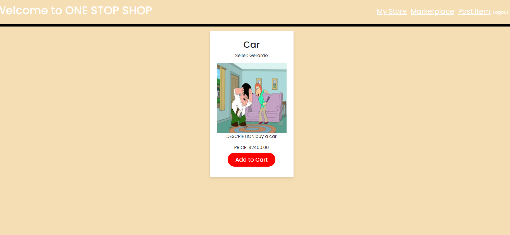

# OneStopShop

## Project Status:
Version Number: 1.0

## Description:
The Marketplace is designed to make it easier for Users and companies to create a personalized store. where they can add products to their store and then post the products they choose to the marketplace for th public to buy. User can also shop the MArketplace to purchase items as well.

## Usage:
To access the page the users will need to set up an account. The register page allows user to enter their name, email, and password which will be saved into the database. If users have an account already then they can access the page by entering their info on the login page.  Users will then be directed into the marketplace for purchasing items. Users can press on the "My Store" tab in the the nav bar to go to their personalized store. It will be empty till the user adds an item. They can do this by pressing on the "Add Item" tab. This will take them to a page that they can enter the seller, name, product name, price, Photo of item, and description of item. By pressing the "ADD TO STORE" button they will be redirected to their Store and see that item in their. each item will have a "ADD TO MARKETPLACE" button on the left that will post that item on the Marketplace.

## Deployment link
http://still-mesa-87070.herokuapp.com/
https://github.com/YacovKopel/OneStopShop

## Support:
for help please contact us at 
https://github.com/YacovKopel
Adrian Alvarez
Yacov Kopel
Phil
Gerardo Alvarez

## Contributing:
Contributions welcome.
requirements:
please dont work on main.
Leave Code clean or better then how you go it.

## Authors:
Yacov Kopel
Adrian Alvarez
Phil
Gerardo Alvarez

