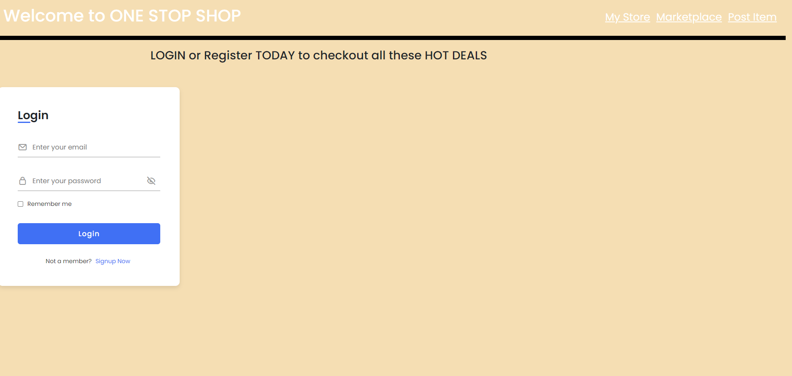

# OneStopShop

## Project Status:

Version Number: 1.0

## description:

The Marketplace is designed to make it easier for Users and companies to Trade/Sell One-Click Apps with a community Marketplacee.

## Usage:
A short description (20-125 words) to go with your post listing in Marketplace. Note that this description is subject to edits before publication.
Become a Marketplace User
Are you interested in listing on the Marketplace? Start by signing in process by URL...

Marketplace listings features and image, price and description. Please follow the directions for submitting and posting . Post submissions will not be accepted without the required assets.

## Support:
for help please contact us at 
https://github.com/YacovKopel/OneStopShop
Adrian Alvarez
Yacov Kopel
Phil
Gerardo Alvarez
and leave us a maessage.

## Roadmap

## Contributing:
Contributions welcome.
requirements:
please dont work on main.
Leave Code clean or better then how you go it.

## Authors:
Yacov Kopel
Adrian Alvarez
Phil
Gerardo Alvarez

Logo
Submit vector files of your app's logo in white and full color. (SVG, EPS, or AI files accepted.)

